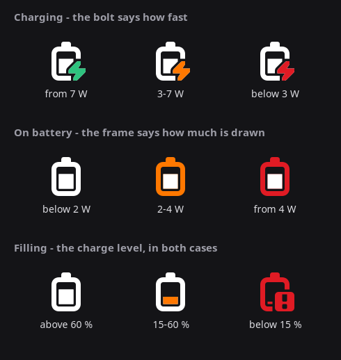

# battery — the battery icon says what it knows

While charging, the FuriPhone shows a bolt and a percentage. Both look the
same whether one watt is going in or six — and that is exactly the number
worth seeing: a tired cable, a laptop port or a charger that has quietly
renegotiated all look like "charging" and cost hours.

The icon has two parts, and from now on they say two different things:

| | what it says | |
|---|---|---|
| **the bolt**, while charging | how fast the battery is filling | green · amber · red |
| **the frame**, on battery | how much is being drawn | plain · amber · red |
| **the filling**, always | how full it is | plain · amber · red |

So: **green** when a lot is going in, **amber** in between, **red** when
hardly anything is moving — and the filling inside takes colour independently
of that when the charge level runs short.

While charging the power colour goes on the **bolt** alone, because there is
a bolt to carry it and the frame is then free to stay out of the way. On
battery there is no bolt, so the frame takes it.



(Drawn with GTK's own renderer from the real icons, not painted by hand:
`python3 doc/make-states.py`. The thresholds in the chart are the
defaults — measured ones may differ.)

The colour of the frame on battery is switched off until somebody switches it
on; the filling always takes colour, because a nearly empty battery should
say so whether it is charging, discharging or full.

A wobbling connection — a broken socket, a tired plug — makes the phone jump
between charging and discharging. The frame does **not** follow that: it
stays plain as long as the readings of one minute do not agree about the
direction. Otherwise the colour would be an indicator of the cable.

For this to work at all, `battctl` brings an **icon theme** of its own:
Adwaita draws the discharge battery as ONE path with the level inside it,
and frame and bolt of the charging battery as one path as well - no CSS
reaches either alone. The theme inherits the user's own theme and replaces
eighteen files with versions whose filling, and whose bolt, are paths of
their own; it lives under `~/.local/share/icons` and goes away again with
`battctl restore`.

Its name carries a fingerprint too (`furios-battery-f8ba`), for the same
reason the GTK theme does: GTK caches an icon theme by name, so a file added
to a theme already in use stays invisible. Measured, while building this:
the bolt icons arrived and the shell went on drawing Adwaita's.

A theme, and not a few files in `~/.local/share/icons/Adwaita`: that would be
the shorter way and it has a trap. GTK remembers where it found an icon; when
that file disappears, the bar draws the placeholder icon and does not recover
— not even when the file is written straight back. Only a change of the theme
setting makes GTK look again, which is why that setting is both the way in
and the way out here. Where a version is missing, the display falls back to
one colour for the whole icon — the more urgent of the two.

And when the kernel and UPower contradict each other about the direction, the
frame stays plain: phosh then draws an icon the colour does not fit. Details
in FINDINGS.md.

```
git clone https://github.com/misc-de/furios_misc
cd furios_misc/battery
./install.sh                 # NEVER with sudo - it needs no root at all
systemctl --user enable --now furios-battery-color.service
```

Or in the app *misc-de*, under **Battery**.

## How the colour reaches the icon

phosh is GTK3, and its battery icon is the CSS node `phosh-battery-info`. One
line of CSS colours it:

```css
phosh-battery-info image {
  -gtk-icon-palette: success #e5a50a, error #e5a50a,   /* filling: < 60 %  */
                     warning #e01b24;                  /* bolt: 1 W in     */
}
```

The icon has up to three areas, and GTK can address them separately:
`color` reaches everything without a class, `success` and `error` the
filling (the low-level icons draw it with the second one), and `warning` the
bolt - the last one only in our own copies, because Adwaita draws frame and
bolt together.

Only the halves that have something to say appear. A palette that named all
three would paint the filling in the colour of the bolt whenever the level
is fine - an 84 % battery went orange that way, on the phone, once.

Where one of the two statements is absent, the line is absent: a rule without
`color` leaves the frame in the colour of the bar, one without the palette
leaves the filling in it. Writing a "white" would mean guessing at a
foreground we cannot read.

The obvious place for all this is `~/.config/gtk-3.0/gtk.css` — and it is a
dead end: GTK3 reads that file **once at program start** and never again. A
colour that changes would therefore need the shell restarted at every change,
and that is the one thing not to do on this phone.

What GTK3 does re-read at runtime is the **theme**. A
`gsettings set org.gnome.desktop.interface gtk-theme …` restyles every
running GTK 3 application within a second, phosh included. So this project
writes themes that are nothing more than the user's theme plus that one rule,
and switches between them:

```
~/.themes/adw-gtk3-batt7e17-red-amber/gtk-3.0/gtk.css
    @import url("file:///usr/share/themes/adw-gtk3/gtk-3.0/gtk.css");
    phosh-battery-info image { color: …; -gtk-icon-palette: …; }
```

The name carries both halves, because both stand in the same file. The
combinations are written only when they are needed — twelve directories in
`~/.themes` would be twelve entries in every theme chooser on the phone.

The four characters in the name are the fingerprint of the rule. They are
there because GTK3 caches a named theme **for the lifetime of the process**,
by name and without a second look at the file: change the rule and keep the
name, and phosh keeps showing the version from back then until the next
restart.

**What that costs** — this belongs before the decision, not after it: every
change briefly restyles all GTK 3 applications, and the theme setting shows
one of our names while it lasts. It happens at a colour change, not
continuously: a handful of times per charge. Anybody who changes their theme
themselves is not overruled — the service notices, builds on the new one and
carries the colour over.

## Thresholds

| | plain | green | amber | red |
|---|---|---|---|---|
| bolt, charging | — | from 7 W | from 3 W | below that |
| frame, on battery | below 2 W | — | from 2 W | from 4 W |
| filling | above 60 % | — | below 60 % | below 15 % |

On battery, **plain is the normal case**: a phone doing what a phone does
says nothing, and only an unusual drain speaks up. There is no green there —
a colour that shines all day is not a message any more.

The values are **provisional**. They belong measured, not guessed — that is
what `battctl watch` is for:

```
battctl watch 3600 --csv ~/drain.csv          # write along for an hour
```

…and `battctl summarise`, which evaluates such a log:

```
battctl summarise ~/drain.csv            # what is in it and what it suggests
battctl summarise ~/drain.csv --apply    # and sets it
```

It splits by state AND by screen, and the thresholds come **only from the
half with the screen on**: this icon is seen only by somebody looking, so
"normal" is what the phone draws in use. What it suggests is **amber at p90,
red at p98** — then the unusual tenth speaks up and the rest stays plain.
Below 30 readings with the screen on, or when p90 and p98 land on the same
number, it sets nothing and says why.

Important here: for the battery case what counts is the drain with the
**screen on**. The 0.2 W of a phone on a table is no sensible baseline. The
log therefore carries the state of the panel along in a column.

The phone negotiates 12.7 W over USB-PD, but at most 5.9 W has been measured
so far — so the charging thresholds are not confirmed either.

```
battctl config charge-green-w 6
battctl config drain-amber-w 2.5
battctl config discharging on
battctl config level-amber-pct 50
battctl config level off        # do not colour the filling at all
battctl config                  # everything there is
```

So that the colour does not flicker on the noise — `current_now` jumps by a
quarter of an amp between two readings — it is not the last value that
decides but the **median** of a minute; a threshold has to be crossed by a
tenth before the colour follows, and every colour stays for at least 45
seconds.

## The time left, instead of the percentage

`battctl config runtime on` puts how long the battery has left where phosh
shows the percentage, as `05:33`.

`battctl config charge_time on` does the same for a phone on a cable: how
long until full. Its own switch, because it is its own question - somebody
who wants to know how long the phone lasts has not thereby asked how long it
charges. Whichever is switched off shows the percentage instead.

It is a charge over a current: `charge_counter` over `current_avg`, median of
a five-minute window. Not `current_now` — measured within one second on
16.9.2026 the two said 0.603 A and 0.378 A for the same steady discharge,
which is 03:29 against 05:33 for the same battery. Where the time cannot be
said — a full battery, a cable that moves nothing, a driver without the
attributes — the strip shows the percentage instead. The spot is never empty.

**How it gets into that spot**, because the obvious way puts it somewhere
else. Switching the percentage off with its gsettings key frees the space and
phosh moves the battery icon straight into it: measured on this 720 px screen
the icon goes from `613..631` to `666..683`, and to its right there is
nothing but 36 px of phosh's own padding. There is no room to the right of
the battery icon unless phosh is still reserving it.

So the key stays **on** and the text is emptied by the theme instead — the
same theme machinery the colour uses, because a theme is the only thing on
this phone that reaches into the running shell:

```css
phosh-battery-info label { color: transparent; font-size: 1px;
                           min-width: 41px; }
```

Each declaration does a different job. `color` takes the text away and leaves
the widget. `font-size` stops the percentage's own text from deciding how
wide the slot is, so 9 %, 48 % and 100 % all reserve the same room — without
it the icons shift under the clock as the battery empties. `min-width` is
then the width, and it has to hold OUR text rather than the percentage's: at
41 the slot fits `04:38` at 16 px with a 15 px gap to the battery icon. Found
by stepping the value and reading the icon positions out of a screenshot — at
29, which was right for 13 px text, the clock touched the icon.

The clock itself is a **layer-shell strip** over the top bar, the way
`killswitch-indicator` draws its icons. Weight and figures are phosh's own
(`font-weight: 800; font-feature-settings: "tnum"`) rather than guessed;
`tnum` is the one that matters, because with proportional digits a clock
changes width at every digit and shifts under itself once a minute. The size
is **16 px**, phosh's clock size rather than its 13 px indicator size: a
percentage is glanced at, a time is read.

**On the lock screen** the strip cannot be seen at all. phoc has no
session-lock protocol, so phosh's lock screen is an ordinary layer surface on
the same OVERLAY layer, and within a layer the newest is on top - the lock
screen is created when the phone is locked, which is after us. Measured with
two strips side by side: the one started second covers the first. So the
blanking is lifted for as long as the phone is locked, and the lock screen
looks exactly as it did before this option existed.

Going the other way, putting the strip back on top of the lock screen, needs
a signal for "the screen came on while locked" and there is none to rely on:
rebuilding on the lock itself leaves no strip at all - locking turns the
panel off in the same breath, and a layer surface created against an output
that is off is never configured - and `PowerSaveMode` was emitted on one lock
and not on the next. Both measured on 16.9.2026.

**The cost**, and it is the reason this is off by default and worth knowing
before switching it on: the switch in **phosh-mobile-settings → Top Bar →
"Show battery percentage"** stays *on* while this runs, so it no longer tells
you what is in the bar. Switch it off there and the slot goes with it — the
strip notices and stands down rather than draw over the battery icon, and
comes back when this option is switched off and on again.

What the setting was is written down before it is touched, so somebody who
had the percentage switched off is not left with it on afterwards. It goes
back when the option goes off, when the daemon stops, and from `battctl
reset` — which is what `ExecStopPost` runs, so a `kill -9` is covered too.

## What it touches

Nothing it would need root for. It reads seven files under
`/sys/class/power_supply/battery`, writes `~/.themes`,
`~/.local/share/icons` and one small state file beside the config, and sets
three gsettings keys. `battctl restore` takes all of that back,
`./uninstall.sh` the program as well.

**Everything is off after an install.** The tool arrives on the phone; what
the phone looks like stays the user's decision, one switch at a time.

The clock is **UPower**: it polls the battery for the whole phone anyway, so
its signal is subscribed to rather than polling ourselves. A slow timer
(120 s) runs underneath as a net.

The config file has a watch of its own, because those two clocks are too slow
for a switch: `runtime on` took up to two minutes to reach the bar when the
only thing that read the config was the next battery reading. It is 0.13 s
now, measured on the device (FINDINGS.md §11).

**What it costs**, measured on the device with `/proc/<pid>/stat` over two
minutes, twice, with the time in the bar switched on: **0.03 % of one core,
about 26 s of CPU a day, and no child processes at all.** It was 0.217 % and
187 s a day until the percentage key was read through `gsettings` on every
tick — two thirds of everything the daemon spent went on forking. Both
gsettings keys are read in-process now. On a phone that never suspends this
is the number that matters, and `cutime`/`cstime` in `/proc/<pid>/stat` is
the cheapest way to see it, because it separates a process's own cost from
what it forks.

## Tests

```
tests/run-tests.sh      # no display, no battery, no root - NEVER with sudo
tests/coverage.sh
```

221 tests, 78 % of the lines. What is missing is the D-Bus wiring of the
daemon and the strip itself — both are proven on the device with `grim` and
`WAYLAND_DEBUG`, not simulated (FINDINGS.md §8, §12). The decision behind the
strip is lifted out of the loop so it can be tested: `strip_action`.
