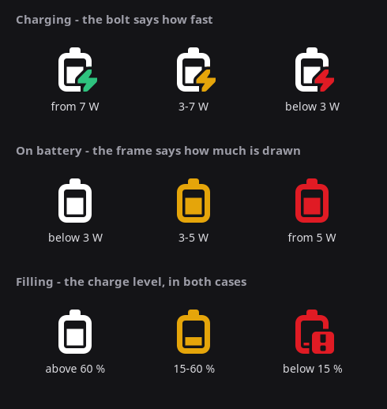

# battery — the battery icon says what it knows

While charging, the FuriPhone shows a bolt and a percentage. Both look the
same whether one watt is going in or six — and that is exactly the number
worth seeing: a tired cable, a laptop port or a charger that has quietly
renegotiated all look like "charging" and cost hours.

The icon has two parts, and they say two different things:

| | what it says | |
|---|---|---|
| **the bolt**, while charging | how fast the battery is filling | green · amber · red |
| **the frame**, on battery | how much is being drawn | plain · amber · red |
| **the filling**, always | how full it is | plain · amber · red |

So: **green** when a lot is going in, **amber** in between, **red** when
hardly anything is moving — and the filling inside takes colour independently
of that when the charge level runs short.



(Drawn with GTK's own renderer from the real icons, not painted by hand:
`python3 doc/make-states.py`. The thresholds in the chart are the
defaults — measured ones may differ.)

Adwaita draws the ordinary discharge battery (above 20 %) as ONE path with
the level inside it, so frame and filling cannot take two colours there: the
more urgent of the two takes the whole icon. The charging icons and the low
ones have the filling as a path of its own.

A wobbling connection — a broken socket, a tired plug — makes the phone jump
between charging and discharging. The power colour (bolt or frame) does
**not** follow that: it stays off as long as the readings of one minute do
not agree about the direction. Otherwise the colour would be an indicator of
the cable. And when the kernel and UPower contradict each other about the
direction, it stays off too: phosh then draws an icon the colour does not
fit. The filling keeps its colour in both cases. Details in FINDINGS.md.

```
git clone https://github.com/misc-de/furios_misc
cd furios_misc/phosh-battery-time && sudo ./install.sh   # the widget, needs a reboot
cd ../battery && ./install.sh                             # NEVER with sudo
systemctl --user enable --now furios-battery-color.service
```

Or in the app *misc-de*, under **Battery**.

## How the colour reaches the icon

Through the widget in phosh's own top bar,
[phosh-battery-time](../phosh-battery-time/), which also shows the time
left. `battctl` decides the colour and writes it into
`$XDG_RUNTIME_DIR/furios-battery-color`:

```
frame #e5a50a
fill #e01b24
```

The widget builds the stylesheet from that itself — `color` for the frame,
`-gtk-icon-palette: success …, warning …, error …` for the filling — and adds
it to the style context of the battery icon's **image alone**. While the
battery charges, the `frame` colour goes on the bolt instead and the outline
stays plain; Adwaita draws both as one path, so the widget paints the bolt
itself (see the widget's README). Nothing else
in the shell sees it, and no other program does. A line it does not
understand means no colour at all rather than CSS from a file.

A half without a line stays in the bar's own foreground. Writing a "white"
would mean guessing at a foreground we cannot read.

**How it used to work, and why not any more.** GTK3 reads
`~/.config/gtk-3.0/gtk.css` only at program start, so until 24.9.2026 this
project switched `org.gnome.desktop.interface gtk-theme` between generated
themes of its own (and `icon-theme` to an icon theme with split-off
fillings), which GTK does re-read at runtime. That broke what was not ours:
phosh applies the accent colour only to the themes it knows by name —
`Adwaita`, `adw-gtk3` and their `-dark` forms — so the quick settings fell
back to blue, and Flatpak apps like Delta Chat, which did not know the name,
lost their dark mode. Proved on the phone: service stopped, `gtk-theme` back
on `adw-gtk3`, buttons grey again. No desktop setting is written any more;
`battctl reset` and the daemon's start put back what an older version left.

## Thresholds

| | plain | green | amber | red |
|---|---|---|---|---|
| bolt, charging | — | from 7 W | from 3 W | below that |
| frame, on battery | below 3 W | — | from 3 W | from 5 W |
| filling | above 60 % | — | below 60 % | below 15 % |

On battery, **plain is the normal case**: a phone doing what a phone does
says nothing, and only an unusual drain speaks up. There is no green there —
a colour that shines all day is not a message any more.

The values are **provisional**. They belong measured, not guessed — that is
what `battctl watch` is for:

```
battctl watch 3600 --csv ~/drain.csv          # write along for an hour
```

…and `battctl summarise`, which evaluates such a log:

```
battctl summarise ~/drain.csv            # what is in it and what it suggests
battctl summarise ~/drain.csv --apply    # and sets it
```

It splits by state AND by screen, and the thresholds come **only from the
half with the screen on**: this icon is seen only by somebody looking, so
"normal" is what the phone draws in use. What it suggests is **amber at p90,
red at p98** — then the unusual tenth speaks up and the rest stays plain.
Below 30 readings with the screen on, or when p90 and p98 land on the same
number, it sets nothing and says why.

Important here: for the battery case what counts is the drain with the
**screen on**. The 0.2 W of a phone on a table is no sensible baseline. The
log therefore carries the state of the panel along in a column.

The phone negotiates 12.7 W over USB-PD, but at most 5.9 W has been measured
so far — so the charging thresholds are not confirmed either.

```
battctl config charge-green-w 6
battctl config drain-amber-w 2.5
battctl config discharging on
battctl config level-amber-pct 50
battctl config level off        # do not colour the filling at all
battctl config                  # everything there is
```

So that the colour does not flicker on the noise — `current_now` jumps by a
quarter of an amp between two readings — it is not the last value that
decides but the **median** of a minute; a threshold has to be crossed by a
tenth before the colour follows, and every colour stays for at least 45
seconds.

## The time left

`battctl config runtime on` puts how long the battery has left in the top
bar, as `05:33`, immediately left of the battery icon.

`battctl config charge_time on` does the same for a phone on a cable: how
long until full. Its own switch, because it is its own question - somebody
who wants to know how long the phone lasts has not thereby asked how long it
charges.

It is the same widget as the colour: in phosh's own indicator box, in the
percentage's font, on the lock screen like everywhere else, and nothing is
taken away to make room for it. phosh reads its plugin directory when it
starts and never again, so a widget installed afterwards is found at the
next reboot. `battctl status` says which it is:

    shown by:     the widget in phosh's bar

It comes from **UPower**: it publishes `TimeToFull` and `TimeToEmpty` for
this battery and keeps a history we do not have. Measured while the socket
was dropping out, UPower said 3:03 where charge-over-current said 51:36. It
goes through a five-minute median all the same — its own estimate swung
between 8:24 and 11:08 on a steady discharge. Our own arithmetic
(`charge_counter` over `current_avg`, not `current_now`: within one second
the two said 0.603 A and 0.378 A for the same discharge) stays as the
fallback for the minutes after a start, when UPower answers 0. Where no time
can be said — a full battery, a cable that moves nothing, above 24 hours —
the widget hides itself and phosh's percentage beside it is the reading.

## What it touches

Nothing it would need root for. It reads seven files under
`/sys/class/power_supply/battery` and writes two small files in the runtime
directory — the colour and the time — plus the config. The one desktop
setting it writes is `mobi.phosh.shell.plugins status-icons`, the list the
widget has to be on to be loaded at all: our name is added while an option
is on and taken out again when none is, and the rest of the list is left
alone. `battctl restore` takes all of that back, `./uninstall.sh` the
program as well.

**Everything is off after an install.** The tool arrives on the phone; what
the phone looks like stays the user's decision, one switch at a time.

The clock is **UPower**: it polls the battery for the whole phone anyway, so
its signal is subscribed to rather than polling ourselves. A slow timer
(120 s) runs underneath as a net, and the config file has a watch of its
own, so a switch thrown in the app is in the bar within a fraction of a
second (FINDINGS.md §11).

## Tests

```
tests/run-tests.sh      # no display, no battery, no root - NEVER with sudo
tests/coverage.sh
```

What is missing is the D-Bus wiring of the daemon — proven on the device,
not simulated. The widget has tests of its own in
[phosh-battery-time](../phosh-battery-time/), which load it the way the
shell does and check that the colour reaches the battery's image and no
other.
